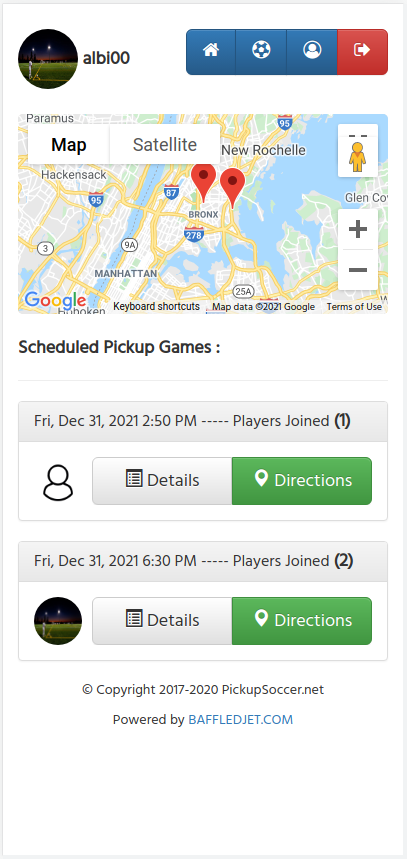

**ABOUT :** PICKUP SOCCER (2017) is a social network built with Laravel Framework that allows registered users to coordinate pickup games and/or join games organized by other members. By utilizing Google Maps API, members are also able to interact with others within the range of their respective location.

**DEMO :** https://pickupsoccer.net/

**INSTALLATION GUIDE<br>**

Download pickupsoccer project and run the following commands inside "pickup-soccer-main" directory :

**1. Dependencies**
```
$ sudo apt install openssl php-common php-curl php-json php-mbstring php-mysql php-xml php-zip
$ composer install
$ npm install
```
**2. Install .env file and generate key<br>**
```
$ cp .env.example .env
$ php artisan key:generate
```
**3. Modify .env file<br>**
```
DB_DATABASE=pk_soccer
DB_USERNAME=laravel
DB_PASSWORD=laravelpass
```
**3. Import DB file<br>**
```
$ sudo mysql -u root
mysql> CREATE DATABASE pk_soccer;
mysql> CREATE USER 'laravel'@'localhost' IDENTIFIED BY 'laravelpass';
mysql> GRANT ALL PRIVILEGES ON pk_soccer . * TO 'laravel'@'localhost';
mysql> use pk_soccer;
mysql> source importdb.sql;
mysql> exit;
```
**4. Run Application<br>**
```
$ php artisan serve
```
**5. Login to Application<br>**
```
127.0.0.1:8000
u: pickupsoccer@test.com
p: soccer12
```
**NOTE - THE APPLICATION WILL REQUIRE A NEW GOOGE PLACES API KEY in :<br>**
```
views/item.blade.php
views/layouts/app.blade.php
views/include/jsprofile.blade.php
views/include/jspost.blade.php
views/include/jsmainpage.blade.php
views/include/jsitem.blade.php
```





